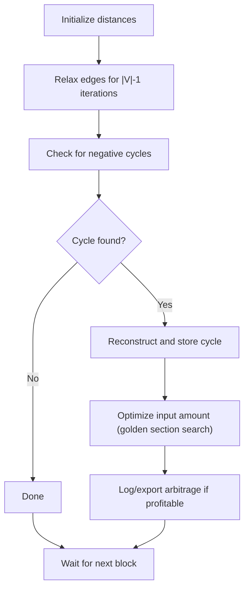

# Tycho Searcher
Demo of a tycho seacher algorithm

Tycho Searcher is a high-performance, async Rust engine for real-time detection of arbitrage opportunities in decentralized exchange (DEX) graphs. It ingests live blockchain data, maintains a dynamic graph of token pools, and applies an optimized Bellman-Ford algorithm to find negative cycles (profitable arbitrage paths) with gas-aware profit optimization.

## Features
- **Real-time DEX graph updates** from Tycho feed
- **Efficient negative cycle detection** (arbitrage) using a modified Bellman-Ford
- **Gas cost and slippage aware profit calculation**
- **Golden section search** for optimal input sizing
- **Robust, warning-free Rust codebase**
- **Detailed LaTeX documentation** with diagrams and pseudo-code

## Architecture & Algorithm
- The Searcher receives block updates and pool state from a Tycho feed (see [tycho-simulation](https://github.com/propeller-heads/tycho-simulation)).
- Each block triggers a graph update and arbitrage search:
  1. **Graph update:** Pools/tokens are added/removed as needed.
  2. **Component search:** For each connected component, Bellman-Ford is run from the start token.
  3. **Negative cycle detection:** Cycles are reconstructed and filtered for profitability (gas included).
  4. **Profit optimization:** For each cycle, a golden section search finds the most profitable input amount.
- See `doc/Searcher_documentation.tex` for full algorithm details, diagrams, and pseudo-code.

## Bellman-Ford Algorithm in Tycho Searcher

The Tycho Searcher uses a **modified Bellman-Ford algorithm** to detect negative cycles in a dynamic DEX graph, which correspond to profitable arbitrage opportunities.

### Overview
- **Purpose:** Find negative cycles (arbitrage loops) in a directed graph where nodes are tokens and edges are DEX pools with exchange rates.
- **Edge Weights:** Calculated as the negative logarithm of the exchange rate, so a negative cycle means a product of rates > 1 (i.e., profit).
- **Precision:** Uses `BigUint` for all token amounts to avoid overflow and rounding errors.

### Algorithm Steps
1. **Initialization**
   - Set the distance to all nodes as infinity, except the source node (set to zero).
   - Set all predecessors to `None`.
2. **Relaxation**
   - For `|V|-1` iterations (where `|V|` is the number of nodes):
     - For each edge `(u, v)`:
       - If `distance[v] > distance[u] + weight(u, v)`:
         - Update `distance[v] = distance[u] + weight(u, v)`
         - Set `predecessor[v] = u`
3. **Negative Cycle Detection**
   - After relaxation, for each edge `(u, v)`:
     - If `distance[v] > distance[u] + weight(u, v)`, a negative cycle exists.
     - Reconstruct the cycle using the `predecessor` array.
4. **Cycle Storage**
   - Detected cycles are stored as `Rc<Vec<EdgeIndex>>` to avoid unnecessary cloning and memory usage.
5. **Profit Optimization**
   - For each cycle, a **golden section search** is performed to find the input amount that maximizes profit, taking gas costs into account.

### Pseudo-code
```rust
// Initialization
for each node v:
    distance[v] = INF
    predecessor[v] = None
distance[source] = 0

// Relaxation
for i in 1..=V-1:
    for each edge (u, v):
        if distance[v] > distance[u] + weight(u, v):
            distance[v] = distance[u] + weight(u, v)
            predecessor[v] = u

// Negative cycle detection
for each edge (u, v):
    if distance[v] > distance[u] + weight(u, v):
        // Negative cycle found
        reconstruct cycle using predecessor[]
        store as Rc<Vec<EdgeIndex>>
```

### Optimizations & Edge Cases
- **Reference Counting:** Cycles are stored as `Rc<Vec<EdgeIndex>>` to minimize memory usage.
- **Gas-Aware Profit:** Profit calculation includes gas costs; only cycles with net positive profit are considered.
- **Golden Section Search:** The input amount for each cycle is optimized using golden section search for maximum profit.
- **Cycle Filtering:** Only cycles starting and ending at the designated start token (e.g., WETH) are considered.
- **Infinite Loop Protection:** Path reconstruction and cycle detection include safeguards against infinite loops.

### Diagram


## Quick Start

### Requirements
- Rust (edition 2021, recommended: latest stable)
- Cargo
- [tycho-simulation](https://github.com/propeller-heads/tycho-simulation) and dependencies
- A working Tycho feed endpoint and API key

### Build
```sh
cargo build --release
```

### Run
Set up your environment (see `.env.example`):
```sh
export TYCHO_URL=...         # Tycho feed endpoint
export TYCHO_API_KEY=...     # Your API key
export RPC_URL=...           # Ethereum RPC endpoint
cargo run --release -- [OPTIONS]
```

### CLI Options
The Searcher supports many CLI flags (see `src/command_line_parameters.rs` for all):

- `--chain <CHAIN>`: Target blockchain (default: ethereum)
- `--tvl-threshold <FLOAT>`: TVL filter for pools (default: 10.0)
- `--start-token <ADDRESS>`: Start token address (default: WETH)
- `--start-token-amount <FLOAT>`: Input amount for search
- `--all-pools`: Include all supported DEXes
- `--bf-max-iterations <N>`: Bellman-Ford iterations
- `--enable-bf-logging`: Enable detailed Bellman-Ford logs

Example:
```sh
cargo run --release -- --chain ethereum --tvl-threshold 1000 --all-pools --enable-bf-logging
```

## Documentation
- See `doc/Searcher_documentation.tex` for a full technical write-up (algorithm, diagrams, pseudo-code).
- Code is organized under `src/Searcher/` (modular, well-commented).
- Example/test cases: see `tests/`.

## Contribution & License
- Contributions are welcome! Please open issues or pull requests.
- License: Specify your license here (e.g., MIT, Apache-2.0, etc.)

## Example Workflow
1. Start the Searcher with your Tycho feed and RPC credentials.
2. The Searcher will print block updates, detected arbitrage cycles, and (if enabled) detailed logs.
3. Arbitrage opportunities are logged/exported for further analysis or execution.

---

For more details, see the documentation and source code. Happy arbitraging! 