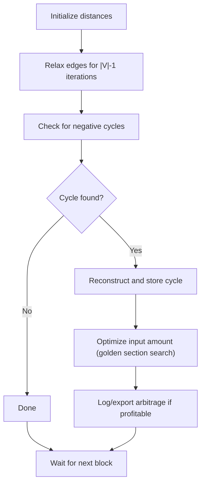

# Tycho Searcher - DeFi Arbitrage Detection Engine

Tycho Searcher is a high-performance arbitrage detection engine built with Rust and the [Tycho library](https://docs.propellerheads.xyz/tycho). This project demonstrates real-time arbitrage opportunity detection across multiple decentralized exchanges using advanced graph algorithms and gas-optimized profit calculations.

## Features

- **Real-time DEX Monitoring**: Connects to Tycho's live data feed for block-by-block pool state updates
- **Graph-based Arbitrage Detection**: Builds token trading graphs to efficiently discover negative cycles (arbitrage opportunities)
- **Gas-aware Profit Optimization**: Golden section search for optimal trade sizing considering gas costs and flashloan fees
- **Multi-chain Support**: Works on Ethereum, Base, and Unichain networks
- **Robust Bellman-Ford Implementation**: Modified algorithm with BigUint precision and cycle reconstruction
- **Configurable Logging**: Separate toggles for pool quoter and arbitrage logs

## Architecture

The system follows a modular architecture with clear separation of concerns:

```
Tycho Stream → Graph Updates → Bellman-Ford → Cycle Detection → Profit Optimization
```

- **`src/searcher/`**: Core arbitrage detection logic and graph management
- **`src/searcher/bellman_ford.rs`**: Modified Bellman-Ford algorithm for negative cycle detection
- **`src/searcher/price_quoter.rs`**: Pool state simulation and price calculation
- **`src/searcher/graph_components.rs`**: Connected component analysis
- **`src/searcher/logging.rs`**: Centralized logging with category toggles

## Algorithm Details

### Bellman-Ford for Arbitrage Detection

The core algorithm uses a **modified Bellman-Ford** to detect negative cycles in DEX graphs:

1. **Graph Representation**: Tokens as nodes, pools as directed edges with exchange rates
2. **Negative Cycles**: Correspond to profitable arbitrage opportunities  
3. **Precision**: Uses `BigUint` for all calculations to avoid overflow and rounding errors
4. **Gas Integration**: Incorporates gas costs and flashloan fees (0.05%) in profit calculations
5. **Optimization**: Golden section search finds optimal input amounts for maximum profit

### Key Optimizations

- **Reference-counted cycles**: `Rc<Vec<EdgeIndex>>` to avoid unnecessary cloning
- **Efficient graph traversal**: Reuses edge references and minimizes allocations
- **Early termination**: Stops when no profitable cycles remain
- **Component isolation**: Processes connected components independently

### Quick Start

Prerequisites

- Rust (recommended: stable >= 1.89.0)
- Cargo
- Tycho API access (use `TYCHO_URL` environment variable or default endpoints)

Setup

1. Clone the repository:
    ```bash
    git clone <repository-url>
    cd tycho-searcher
    ```

2. Set up environment (example):
    ```bash
    # RPC provider used for gas price lookups
    export RPC_URL=https://mainnet.infura.io/v3/YOUR_INFURA_KEY
    # Optional: Set custom Tycho endpoint
    export TYCHO_URL=https://your-tycho-endpoint.com
    ```

3. Build and run the searcher (example):
    ```bash
    cargo build --release
    cargo run --release -- --chain ethereum --tvl-threshold 10.0
    ```

## Configuration

### Command Line Options

The CLI flags are implemented with `clap` (see `src/command_line_parameters.rs`). Key flags:

```text
--chain <CHAIN>                Target blockchain (ethereum, base, unichain). Default: "ethereum"
--tvl-threshold <FLOAT>        TVL filter for pools. Default: 10.0
--start-token <ADDRESS>        Starting token address (default: wrapped ETH address in code)
--uniswap-pools                When set, register only Uniswap exchanges (uniswap_v2/v3/v4)

# Bellman-Ford / search params
--bf-max-iterations <N>        Max Bellman-Ford iterations (default: 4)
--bf-amount-in-min <FLOAT>    Min input amount for GSS (default: 0.001)
--bf-amount-in-max <FLOAT>    Max input amount for GSS (default: 1000.0)
--bf-max-outer-iterations <N>  (internal tuning parameter; default from source)
--bf-gss-tolerance <FLOAT>     Golden-section search tolerance (default: 1e-4)
--bf-gss-max-iter <N>         Golden-section search max iterations (default: 40)

# Logging
--log                         Enable all console logs
--log-pool                    Enable POOL (quoter) logs
--log-arb                     Enable ARB (arbitrage) logs

# Export
--export-graph                Export graph JSON (writes `full_graph.json`, `largest_component.json`)
```

### Advanced Usage

Monitor Ethereum mainnet with detailed logging:
```bash
cargo run --release -- \
  --chain ethereum \
  --tvl-threshold 100.0 \
  --bf-max-iterations 6 \
  --log-arb \
  --export-graph
```

Run on Base network with custom parameters:
```bash
cargo run --release -- \
  --chain base \
  --tvl-threshold 50.0 \
  --bf-amount-in-max 500.0 \
  --log
```

## Output and Monitoring

The searcher provides detailed insights into the arbitrage detection process:

### Console Output
- Block updates and graph statistics
- Component analysis with node/edge counts  
- Cycle detection results and profit calculations
- Golden section search optimization metrics
- Performance timing for bottleneck identification

### JSON Export (with `--export-graph`)
- **`full_graph.json`**: Complete token trading graph
- **`largest_component.json`**: Main connected component

### Logging Categories
- **[POOL]**: Pool state updates and quoter calculations
- **[ARB]**: Arbitrage opportunities and profit optimization

## Performance Notes

The searcher includes several optimizations for production use:

- **Efficient data structures**: Minimal cloning with reference counting
- **Optimized graph operations**: Reused edge references and streamlined traversal
- **Configurable search bounds**: Tune parameters based on market conditions
- **Component isolation**: Parallel processing potential for large graphs

For detailed algorithm explanations and mathematical foundations, see `doc/searcher_documentation.pdf`.

## License

This project is provided as-is for educational and research purposes.

### Pseudo-code
```rust
// Initialization
for each node v:
    distance[v] = INF
    predecessor[v] = None
distance[source] = 0

// Relaxation
for i in 1..=V-1:
    for each edge (u, v):
        if distance[v] > distance[u] + weight(u, v):
            distance[v] = distance[u] + weight(u, v)
            predecessor[v] = u

// Negative cycle detection
for each edge (u, v):
    if distance[v] > distance[u] + weight(u, v):
        // Negative cycle found
        reconstruct cycle using predecessor[]
        store as Rc<Vec<EdgeIndex>>
```

### Optimizations & Edge Cases
- **Reference Counting:** Cycles are stored as `Rc<Vec<EdgeIndex>>` to minimize memory usage.
- **Gas-Aware Profit:** Profit calculation includes gas costs; only cycles with net positive profit are considered.
- **Golden Section Search:** The input amount for each cycle is optimized using golden section search for maximum profit.
- **Cycle Filtering:** Only cycles starting and ending at the designated start token (e.g., WETH) are considered.
- **Infinite Loop Protection:** Path reconstruction and cycle detection include safeguards against infinite loops.

### Diagram


## Tools and utilities

Graph analysis helper (Python)

There is a small Python utility in `tools/graph_analyzer.py` to inspect and visualize exported graph JSONs (`largest_component.json`, `full_graph.json`). It can produce matplotlib visualizations and export a TikZ/PGF figure.

Install (recommended in a virtualenv):
```bash
pip install matplotlib networkx pandas
```

Basic usage:
```bash
python3 tools/graph_analyzer.py --file largest_component.json
# interactive plots will be shown with plt.show(); use --no-viz to skip plotting
python3 tools/graph_analyzer.py --file largest_component.json --latex graph.tex
python3 tools/graph_analyzer.py --file largest_component.json --sceleton --latex graph_skeleton.tex
```

Note about Rust toolchain

Some dependencies in the workspace (e.g., Foundry-related crates) require a newer Rust toolchain (>= 1.89). If you encounter errors mentioning an unsupported rustc version, either upgrade your system toolchain or add a `rust-toolchain.toml` at the project root:

```toml
[toolchain]
channel = "1.89.0"
components = ["rustfmt", "clippy"]
```

Build

```sh
cargo build --release
```

Run

Set up your environment (see `.env.example`) and run with the desired options:
```sh
export TYCHO_URL=...         # Tycho feed endpoint
export TYCHO_API_KEY=...     # Your API key
export RPC_URL=...           # Ethereum RPC endpoint
cargo run --release -- --chain ethereum --tvl-threshold 100.0 --export-graph
```

## Documentation
- See `doc/Searcher_documentation.tex` for a full technical write-up (algorithm, diagrams, pseudo-code).
- Code is organized under `src/Searcher/` (modular, well-commented).
- Example/test cases: see `tests/`.

## Contribution & License
- Contributions are welcome! Please open issues or pull requests.
- License: Specify your license here (e.g., MIT, Apache-2.0, etc.)

## Example Workflow
1. Start the Searcher with your Tycho feed and RPC credentials.
2. The Searcher will print block updates, detected arbitrage cycles, and (if enabled) detailed logs.
3. Arbitrage opportunities are logged/exported for further analysis or execution.

---

For more details, see the documentation and source code. Happy arbitraging! 

## Contributors
- Janos Tapolcai (core developer)
